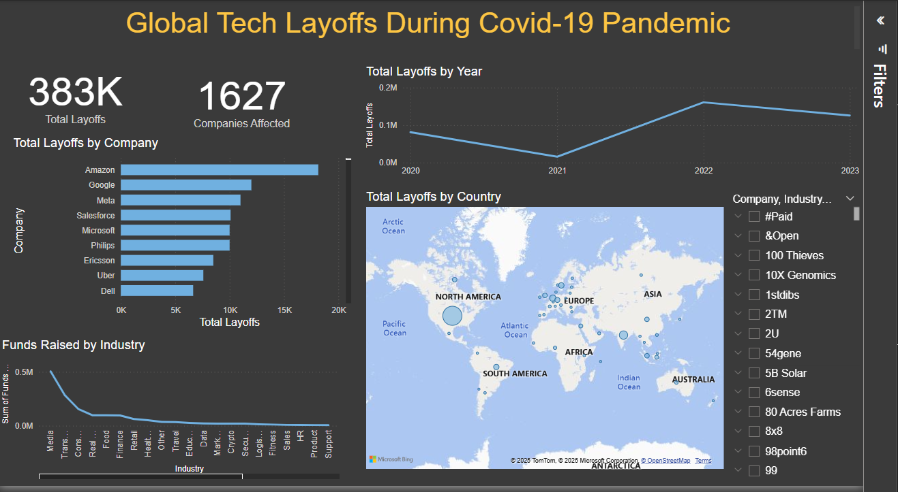
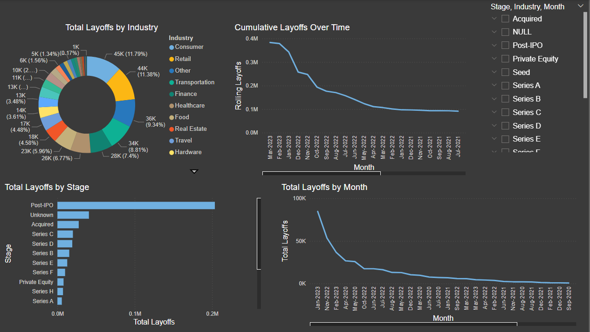
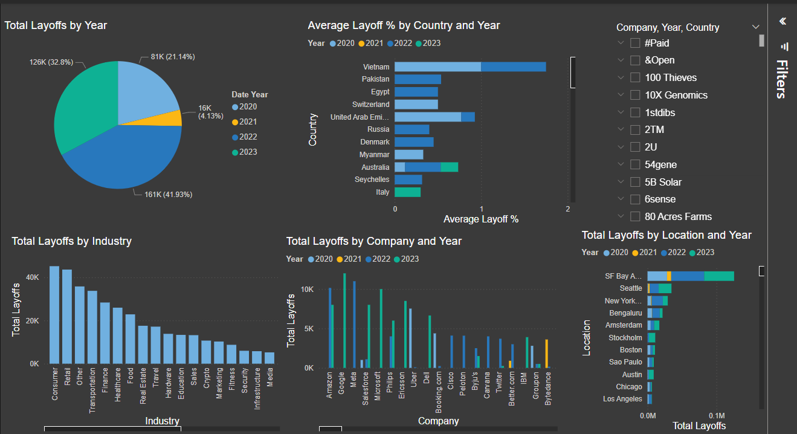

# 💼 Tech Layoffs Analysis (2020–2023)

This project is an end-to-end data analysis using **SQL** and **Power BI** to explore global tech layoffs between 2020 and 2023 during Covid-19 pandemic. It includes data cleaning, transformation, and insightful visualizations.

---

## 📌 Project Overview

- 🔍 **Goal**: Understand layoff trends by company, industry, country, and over time
- 🧹 **Cleaned** the raw data using SQL
- 📊 **Visualized** key insights using Power BI dashboards
- 📁 **Tools Used**: MySQL, Power BI

---

## 🗂 Dataset

- **Source**: Layoffs data collected from public sources
- **Fields** include: Company, Location, Industry, Total Laid Off, Percentage Laid Off, Date, Stage, Country, Funds Raised

---

## 🧹 Data Cleaning (SQL)

Key SQL steps:
- Removed duplicates
- Trimmed inconsistent values
- Standardized country and industry names
- Handled null or missing values
- Converted date formats
- Filtered unnecessary records

📄 [View full SQL script](./data_cleaning.sql)

---

## 📊 Dashboard Overview (Power BI)

Here are the main dashboards created:

### 1️⃣ Overview Dashboard
- Total layoffs by company, country, industry
- Highest percentage layoffs
- Time range: 2020 to 2023

### 2️⃣ Trend Analysis
- Monthly and yearly layoff trends
- Rolling totals for better trend visibility

### 3️⃣ Deep Dive
- Layoffs by funding stage
- Year-wise company-wise layoff leaders
- Industry distribution over time

## 📈 Key Visuals

1. **Total Layoffs by Year (2020–2023)**  
   Bar chart showing the yearly distribution of layoffs.

2. **Layoffs by Country**  
   Map visualization identifying the countries with the highest impact.

3. **Yearly Trend Line**  
   Line graph representing the number of companies affected per year.

4. **Detailed Filters**  
   Interactive slicers for:
   - Year
   - Country
   - Company
   - Funding Stage

---

🖼️ Screenshots:

---

## 🚀 Insights & Highlights

- The **US** saw the highest number of layoffs.
- **2022** was the peak year for layoffs.
- Startups in **late-stage** funding had more layoffs.
- The **Tech & Crypto industries** were hit hardest.

---

## 📬 Contact

Feel free to connect with me:

- **Name**: Shah Md. Farhan Ruhullah  
- 🌐 [LinkedIn](https://www.linkedin.com/in/farhanruhullah/)  
- 📧 farhanruhullah@gmail.com

---

## ⭐ Final Note

This project demonstrates a full pipeline:
**Raw Data → SQL Cleaning → Power BI Dashboard → Insights**

